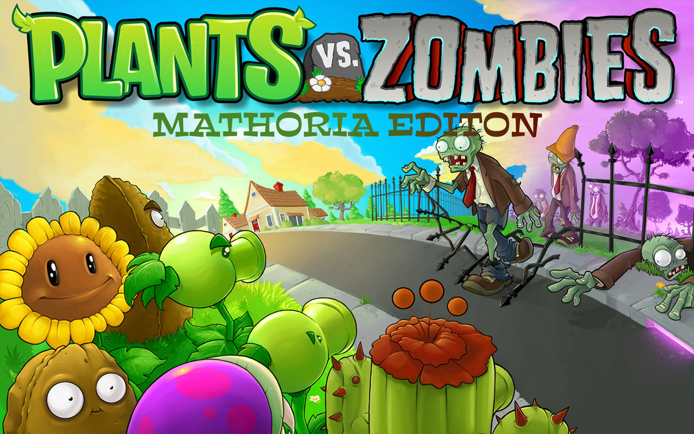

# PvZ-Mathoria 🌱🧮

An educational tower defense game that combines the beloved Plants vs Zombies gameplay with mathematical learning objectives. Defend your garden while solving math problems and strengthening your numerical skills!



## 🎮 About the Game

PvZ-Mathoria is an innovative educational game that merges the strategic tower defense mechanics of Plants vs Zombies with interactive mathematics challenges. Players must solve mathematical problems to unlock plants, upgrade defenses, and progress through increasingly challenging levels.

## ✨ Features

- **Educational Gameplay**: Solve math problems to earn sun points and unlock new plants
- **Progressive Difficulty**: Mathematical challenges scale with professor configuration
- **Classic PvZ Mechanics**: Familiar plant-based tower defense gameplay
- **Math Topic**: Subtraction 
- **Achievement System**: Track progress and celebrate mathematical milestones
- **Kid-Friendly Interface**: Colorful, engaging visuals designed for young learners

### **Key Arithmetic Concepts Considered in Mini-Games**

#### **Subtraction**
- Borrowing when minuend digits are smaller.
- Retaining borrowed values for continuity.
- Step-by-step column-based solving.

## 🚀 Getting Started

### Prerequisites

- Unity 2021.3 or higher
- Android SDK and NDK
- Firebase account
- Git

### Installation

1. Clone the repository:
   ```bash
   git clone https://github.com/iamachrafeaz/PvZ-Mathoria.git
   cd PvZ-Mathoria
   ```

2. **Switch to Android Platform**:
   - Open the project in Unity
   - Go to File → Build Settings
   - Select Android and click "Switch Platform"

3. **Configure Firebase**:
   - Insert your Firebase JSON configuration file in the `assets` folder
   - Install Firebase Database SDK from: https://firebase.google.com/docs/firestore/client/libraries

4. **Setup Test Configuration and Student Data**:
   - Create basic test configuration and student data using the web platform
   - Clone and setup the web platform: https://github.com/mohamediliasskaddar/TARL-WEB-.git

5. **Build and Run**:
   - Connect your Android device or setup an emulator
   - Build and deploy to your Android device

## 🎮 How to Play

1. **Login**: Scan your QR Code from the web plateform
2. **Launch**: Start the game
3. **Solve Operation**: Solve the given problem
4. **Plant Your Defense**: Use sun points to place plants strategically
5. **Defend Your Garden**: Prevent zombies from reaching your house
6. **Progress**: Complete levels to unlock new plants and challenges

## 🏆 Scoring System

- **Correct Answers**: +50 points per correct math problem
  
## 🛠️ Development

### Project Structure

```
PvZ-Mathoria/
├── Assets/
│   ├── Scripts/        # C# game scripts
│   ├── Scenes/         # Unity scenes
│   ├── Prefabs/        # Game prefabs
│   ├── Sprites/        # Game graphics and UI
│   ├── Audio/          # Sound effects and music
│   ├── Fonts/          # Text fonts
│   └── firebase-config.json  # Firebase configuration
├── ProjectSettings/    # Unity project settings
├── Packages/          # Unity package dependencies
└── README.md
```


### Development Setup

1. Clone the repository
2. Open the project in Unity Hub
3. Ensure you have the Android Build Support module installed
4. Set up Firebase:
   - Create a Firebase project at https://console.firebase.google.com/
   - Download the `google-services.json` file
   - Place it in the `Assets/` folder
5. Install Firebase SDK for Unity
6. Configure the web platform for data management:
   ```bash
   git clone https://github.com/mohamediliasskaddar/TARL-WEB-.git
   ```
7. Build and test on Android device

## 🎨 Credits

- **Original PvZ Concept**: Inspired by PopCap Games' Plants vs Zombies
- **Educational Framework**: Developed with input from mathematics educators


## 🤝 Acknowledgments

- Plants vs Zombies by PopCap Games for the original gameplay inspiration
- Educational consultants who helped design the mathematical components
- Contributors and supporters of this project

---

**Made with ❤️ for educators, students, and lifelong learners**
